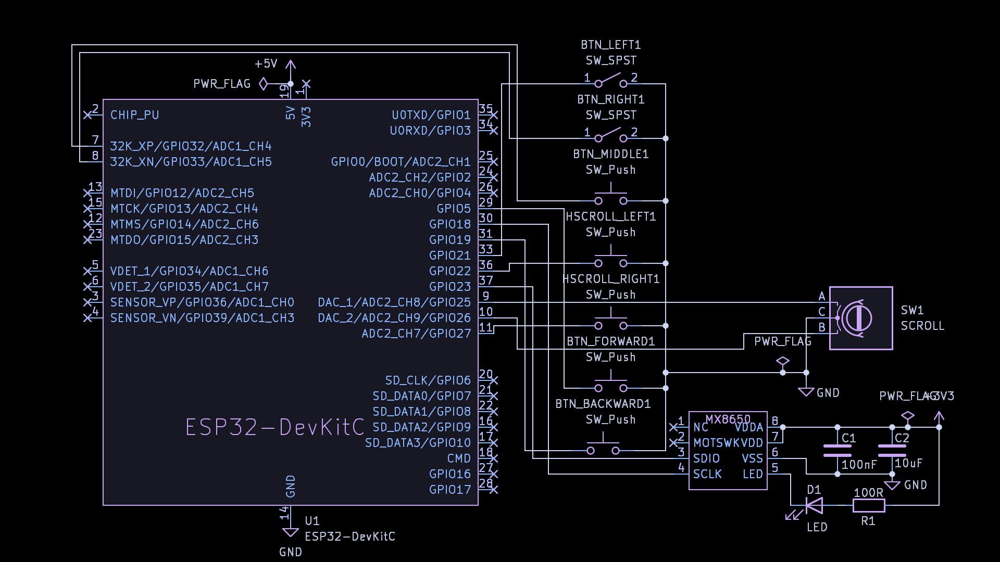
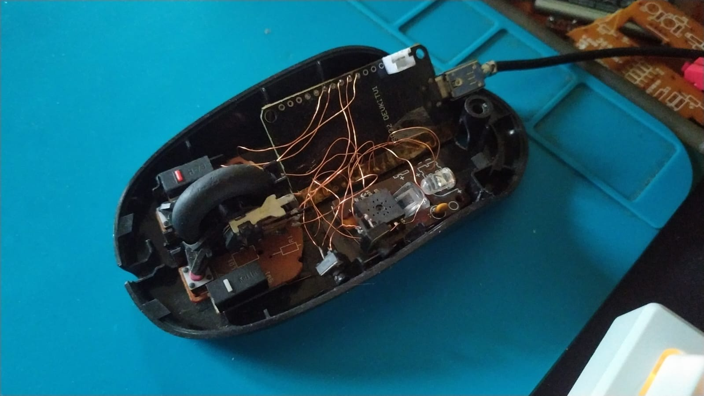

# ESP32 Bluetooth Mouse

DIY Bluetooth Mouse using ESP32 and MX8650 optical sensor and switches form salvaged mouse.

## Features
- Left / Right click
- Middle click
- Thumb forward / back click
- Scroll wheel
- Horizontal scroll
- DPI Mode 800, 1000, 1200 , 1600
- BLE HID
- Battery service

## Hardware
- ESP32 DevKit V1
- MX8650 optical sensor 
- Salvaged mouse swithes
- Logitech donor pcb (AC Pan support)

## Schematic

# Prototype

## Prototype Assembly
Current prototype is built using salvaged components from multiple mice. front button assembly and horizontal scroll mechanism are reused from a Logictech old mouse, and the optical sensor assembly from a generic old Bluetooth mouse.

## Current Status
Working prototype.

Implemented: 
- NimBLE HID
- Cursor movement
- Left / Right click
- Middle click
- Side buttons
- Vertical scroll
- Horizontal scroll
- Adjustable DPI with state machine
- Adaptive polling
